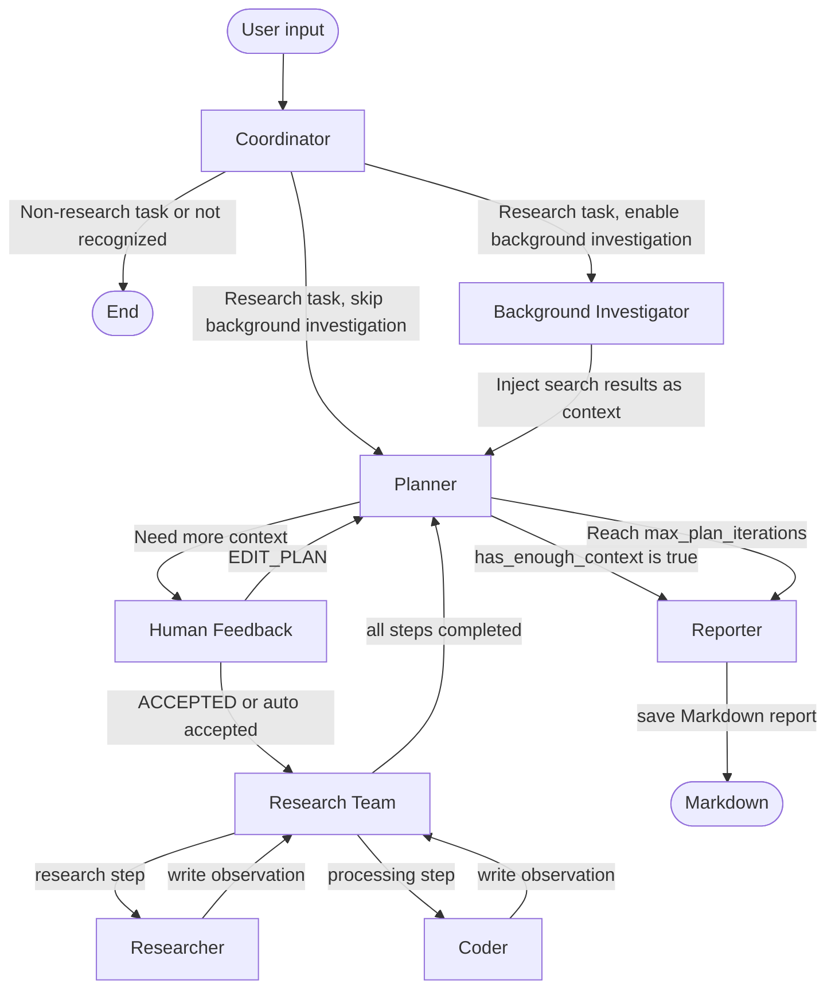

# Deep Research

English | [简体中文](./README.zh-CN.md)

Deep Research is a multi-agent research system built with LangChain and LangGraph. It decomposes complex questions into research plans, executes research and analysis steps, and generates structured Markdown research reports.


## Architecture



## Core Workflow

Deep Research is centered around a LangGraph `StateGraph`. Instead of answering a question with a single model call, it builds an iterative workflow around planning, execution, feedback, and report generation.

### Coordinator

The Coordinator receives user input, decides whether the task should enter the research workflow, and extracts `research_topic` and `locale`. If `enable_background_investigation` is enabled, the task enters the Background Investigator first; otherwise it goes directly to the Planner.

### Background Investigator

The Background Investigator is optional. It performs a web search before formal planning and injects the search results into the Planner as background context, helping the plan stay grounded in current and factual information.

### Planner

The Planner generates a structured research plan represented by `Plan`, including:

- `title`: research title
- `thought`: planning rationale
- `steps`: list of research steps

Each `Step` contains fields such as `title`, `description`, and `step_type`. The supported step types are:

- `research`: assigned to the Researcher for web search and source collection
- `processing`: assigned to the Coder for computation, data analysis, or chart generation

If the Planner determines that enough context is already available, meaning `has_enough_context=true`, the workflow proceeds directly to the Reporter. Otherwise, the plan enters Human Feedback for review.

### Human Feedback

Human Feedback supports manual confirmation or modification of the research plan:

- `[ACCEPTED]`: accept the current plan and start execution
- `[EDIT_PLAN]`: ask the Planner to regenerate the plan based on feedback

In the command-line workflow, plans are auto accepted by default through `auto_accepted_plan=true`, which is suitable for automated runs.

### Research Team

The Research Team iterates over `Plan.steps`, finds the first unexecuted step, and routes it by `step_type`:

- `research` -> Researcher
- `processing` -> Coder

Each completed step writes its result into `observations`. When all steps are completed, the workflow returns to the Planner, which can decide whether to iterate again or generate the final report.

### Researcher

The Researcher uses web search tools to execute research tasks. It collects facts, source links, citations, and supporting materials. It can also be extended with MCP-based external data sources or tools, such as GitHub Trending.

### Coder

The Coder uses a Python REPL for processing tasks. It is suitable for computation, data cleaning, table analysis, chart generation, and code-assisted analysis.

### Reporter

The Reporter summarizes all `observations` and generates a structured Markdown report in the user's `locale`. The default report structure includes:

- Key Points
- Overview
- Detailed Analysis
- Key Citations

For comparisons, statistics, and option analysis, the Reporter prioritizes Markdown tables. The final report is automatically saved as `{title}.md`.

## Quick Start

### 1. Clone the Repository

```bash
git clone <repository-url>
cd DeepResearch
```

### 2. Install Dependencies

Using `uv` is recommended:

```bash
uv sync
```

You can also install the project with `pip`:

```bash
pip install -e .
```

### 3. Configure Environment Variables

Copy the environment template:

```bash
cp .env.example .env
```

Fill in the required values in `.env`:

```env
LLM_BASE_URL=https://dashscope.aliyuncs.com/compatible-mode/v1
LLM_API_KEY=your_llm_api_key
LLM_MODEL=qwen3-max
LLM_TEMPERATURE=1.2
TAVILY_API_KEY=your_tavily_api_key
SEARCH_API=tavily
AGENT_RECURSION_LIMIT=25
```

### 4. Run

Ask a question directly:

```bash
python main.py "Research the development trends of multi-agent research systems in the last three years and analyze the advantages of LangGraph"
```

Disable background investigation:

```bash
python main.py "Analyze the difference between RAG and Agentic RAG" --no-background-investigation
```

Enable debug logs:

```bash
python main.py "Research the latest progress in China's large model application ecosystem" --debug
```

## Configuration

### Environment Variables

| Variable | Default | Description |
| --- | --- | --- |
| `LLM_BASE_URL` | None | OpenAI-compatible model service base URL, for example DashScope's compatible endpoint. |
| `LLM_API_KEY` | None | API key for the OpenAI-compatible model service. |
| `LLM_MODEL` | None | Model name, for example `qwen3-max`. |
| `LLM_TEMPERATURE` | None | Model sampling temperature. |
| `DASHSCOPE_API_KEY` | None | Backward-compatible alias. Prefer `LLM_API_KEY`. |
| `SEARCH_API` | None | Search engine selector. |
| `TAVILY_API_KEY` | None | Tavily Search API key. Required when `SEARCH_API=tavily`. |
| `AGENT_RECURSION_LIMIT` | `25` | Recursion limit for agent graph execution. |

### Search Engine Options

`SEARCH_API` can be configured with the following values:

| Value | Description |
| --- | --- |
| `tavily` | Tavily Search, suitable for general web research. Requires `TAVILY_API_KEY`. |
| `duckduckgo` | DuckDuckGo Search, suitable for general search without an API key. |
| `brave_search` | Brave Search, suitable for an independent search index. |
| `arxiv` | ArXiv, suitable for papers and academic resources. |
| `searx` | SearX / SearXNG, suitable for self-hosted metasearch. |
| `wikipedia` | Wikipedia, suitable for encyclopedic background knowledge. |

### Command-Line Arguments

| Argument | Default | Description |
| --- | --- | --- |
| `query` | None | User query passed directly from the command line. |
| `--interactive` | `false` | Run with the built-in interactive question path. |
| `--debug` | `false` | Print more detailed debug logs. |
| `--max_plan_iterations` | `1` | Maximum number of planning iterations. |
| `--max_step_num` | `3` | Maximum number of steps in each plan. |
| `--no-background-investigation` | `false` | Disable background investigation before planning. |

## Examples

### General Research Report

```bash
python main.py "Research applications of multimodal large models in education in 2025 and compare representative products"
```

The system identifies the research topic, runs background search, creates a plan, executes research steps, and generates a Markdown report. The report usually includes key findings, an overview, topic-based analysis, and references.

### Control Plan Complexity

```bash
python main.py "Analyze the differences between LangGraph and AutoGen in multi-agent orchestration" --max_step_num 5 --max_plan_iterations 2
```

This allows the Planner to generate more steps and perform another planning decision after a round of research, which is useful for more complex questions.

### Disable Background Investigation

```bash
python main.py "Explain the role of Pydantic in agent state modeling" --no-background-investigation
```

When background investigation is disabled, the Coordinator sends the research task directly to the Planner. This is suitable for questions that do not depend on the latest web information.

## Project Structure

```text
DeepResearch/
├── agents/                 # Agent construction and LLM wrapper
├── config/                 # Environment variables, search engines, and runtime configuration
├── graph/                  # LangGraph StateGraph nodes, state, and edges
├── prompts/                # Prompts for Coordinator, Planner, Researcher, Coder, and Reporter
├── tools/                  # Search tools, Python REPL, decorators, and post-processing logic
├── utils/                  # JSON repair, context management, and shared utilities
├── main.py                 # Command-line entry point
├── workflow.py             # Workflow startup, initial state, and MCP example configuration
├── graph.py                # Compatibility entry for graph construction
├── pyproject.toml          # Project dependencies and Python version configuration
├── .env.example            # Environment variable template
├── README.md               # Language selection page
├── README.en.md            # English documentation
└── README.zh-CN.md         # Simplified Chinese documentation
```

## Extension Guide

### Add a New Search or Data Tool

1. Implement a new tool function or LangChain Tool under `tools/`.
2. If it is a search engine, add an enum value in `SearchEngine` in `config/tools.py`.
3. Return the corresponding tool in `tools/search.py` from `get_web_search_tool()` based on `SEARCH_API`.
4. Add the required API key or service URL to `.env.example` and the README files.

The Researcher loads the tool returned by `get_web_search_tool(max_search_results)`, so newly added search tools become available to research steps once they are wired into that function.

### Add a New MCP Service

The project supports MCP through `langchain-mcp-adapters`. The current `workflow.py` includes an example `mcp-github-trending` configuration, which injects `get_github_trending_repositories` into the Researcher.

To add a new MCP service, add a server configuration under `mcp_settings.servers`:

```python
"mcp_settings": {
    "servers": {
        "your-mcp-server": {
            "transport": "stdio",
            "command": "uvx",
            "args": ["your-mcp-package"],
            "enabled_tools": ["your_tool_name"],
            "add_to_agents": ["researcher"],
        }
    }
}
```

Key fields:

| Field | Description |
| --- | --- |
| `transport` | MCP transport, such as `stdio`. |
| `command` | Command used to start the MCP service. |
| `args` | Startup arguments. |
| `enabled_tools` | Tool names allowed to be injected into agents. |
| `add_to_agents` | Target agents, such as `researcher` or `coder`. |

If you want to use an MCP tool for data analysis or code processing tasks, add `coder` to the target agents and make sure the tool is suitable for processing steps.

## License

This project is released under the MIT License. See [LICENSE](./LICENSE).
