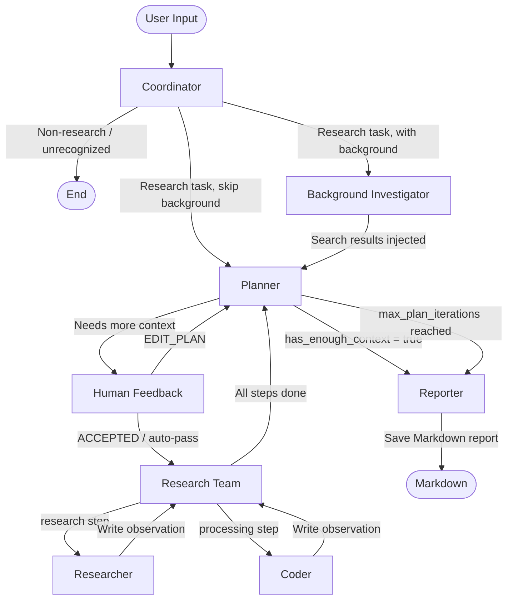

语言环境：[🇨🇳 简体中文](./README.zh-CN.md)

# Deep Research

Deep Research is a multi-agent intelligent research system built with LangChain + LangGraph, designed to automatically decompose, investigate, analyze complex questions and generate structured Markdown research reports.


## Architecture



## Core Workflow

### Coordinator
Receives user input, determines whether a research workflow is needed, and extracts the `research_topic` and `locale`. If `enable_background_investigation` is on, the task goes through the Background Investigator first; otherwise directly to the Planner.

### Background Investigator (optional)
Performs a pre-search before formal planning, injecting search results as context into the Planner to help it generate more timely and fact-aware research plans.

### Planner
Generates a structured research plan including:
- `title`: research title
- `thought`: planning rationale
- `steps`: list of research steps

Each step has a `step_type`:
- `research` → executed by Researcher (web search & investigation)
- `processing` → executed by Coder (computation, data analysis, charting)

If the Planner deems existing information sufficient (`has_enough_context=true`), it goes directly to Reporter. Otherwise the plan goes through Human Feedback review.

### Human Feedback
Supports manual confirmation or editing of research plans:
- `[ACCEPTED]`: accept the current plan and begin execution
- `[EDIT_PLAN]`: ask the Planner to regenerate based on feedback

In CLI mode, plans are auto-accepted by default via `auto_accepted_plan=true`.

### Research Team
Iterates through `Plan.steps`, finds unexecuted steps, and routes them by type. After all steps complete, flow returns to the Planner for potential further iteration or final reporting.

### Researcher
Executes `research` tasks using web search tools, collecting facts, sources, and citations. Supports MCP-based tool extensions.

### Coder
Executes `processing` tasks using a Python REPL — suitable for computation, data cleaning, table analysis, chart generation, and code-assisted analysis.

### Reporter
Aggregates all step `observations` and generates a structured Markdown report in the user's locale. Default report structure:
- Key Points
- Overview
- Detailed Analysis
- Key Citations

Comparison data, statistics, and option analysis are preferentially rendered as Markdown tables. The final report is saved as `{title}.md`.

## Quick Start

### 1. Clone

```bash
git clone <repository-url>
cd DeepResearch
```

### 2. Install dependencies

Using `uv` (recommended):

```bash
uv sync
```

Or using `pip`:

```bash
pip install -e .
```

### 3. Configure environment

```bash
cp .env.example .env
```

Fill in the required keys in `.env`:

```env
DASHSCOPE_API_KEY=your_dashscope_api_key
TAVILY_API_KEY=your_tavily_api_key
SEARCH_API=tavily
AGENT_RECURSION_LIMIT=25
```

### 4. Run

Basic query:

```bash
python main.py "Research the trends of multi-agent systems in the last 3 years and analyze LangGraph's advantages"
```

Disable background investigation:

```bash
python main.py "Analyze the difference between RAG and Agentic RAG" --no-background-investigation
```

Enable debug logging:

```bash
python main.py "Investigate the latest progress of LLM application ecosystem" --debug
```

## Configuration

### Environment Variables

| Variable | Default | Description |
| --- | --- | --- |
| `DASHSCOPE_API_KEY` | — | Alibaba Cloud DashScope API Key (OpenAI-compatible, for Qwen models) |
| `SEARCH_API` | `tavily` | Search engine selection |
| `TAVILY_API_KEY` | — | Tavily Search API Key |
| `AGENT_RECURSION_LIMIT` | `25` | Agent graph recursion limit |

### Search Engine Options

| Value | Description |
| --- | --- |
| `tavily` | Tavily Search (requires API key) |
| `duckduckgo` | DuckDuckGo Search (no API key needed) |
| `brave_search` | Brave Search |
| `arxiv` | ArXiv (academic papers) |
| `searx` | SearX / SearXNG (self-hosted meta-search) |
| `wikipedia` | Wikipedia |

### CLI Arguments

| Argument | Default | Description |
| --- | --- | --- |
| `query` | — | User question (positional) |
| `--interactive` | `false` | Interactive mode |
| `--debug` | `false` | Verbose debug logging |
| `--max_plan_iterations` | `1` | Max planning iterations |
| `--max_step_num` | `3` | Max steps per plan |
| `--no-background-investigation` | `false` | Skip pre-search |

## Project Structure

```text
DeepResearch/
├── agents/          # Agent construction & LLM wrappers
├── config/          # Environment, search engine & runtime config
├── graph/           # LangGraph StateGraph nodes, state & edges
├── prompts/         # Prompts for all agents
├── tools/           # Search tools, Python REPL, decorators & post-processing
├── utils/           # JSON repair, context management & utilities
├── main.py          # CLI entry point
├── workflow.py      # Workflow launcher & MCP example config
├── graph.py         # Graph builder compatibility entry
├── pyproject.toml   # Project metadata & dependencies
├── .env.example     # Environment template
└── README.md        # This file
```

## Extending

### Adding a new search tool
1. Implement the tool in `tools/`
2. Add the enum in `config/tools.py`
3. Wire it up in `tools/search.py` → `get_web_search_tool()`
4. Document required keys in `.env.example`

### Adding a new MCP service
Add a server entry in the runtime config:

```python
"mcp_settings": {
    "servers": {
        "your-mcp-server": {
            "transport": "stdio",
            "command": "uvx",
            "args": ["your-mcp-package"],
            "enabled_tools": ["your_tool_name"],
            "add_to_agents": ["researcher"],
        }
    }
}
```

## License

MIT — see [LICENSE](./LICENSE).
