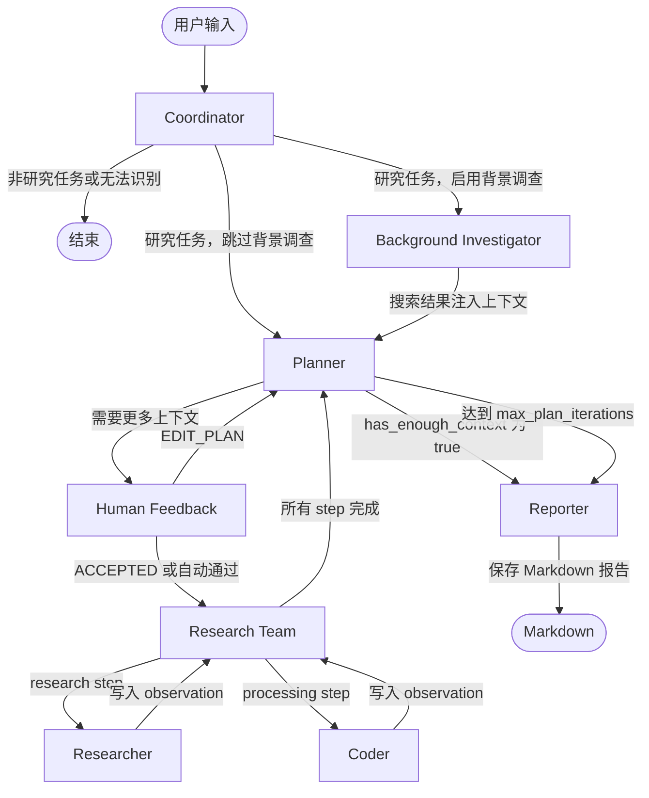

# Deep Research

Deep Research 是一个基于 LangChain + LangGraph 构建的多 Agent 智能研究系统，用于将复杂问题自动拆解、调研、分析并生成结构化 Markdown 研究报告。


## 架构图



## 核心工作流

Deep Research 的核心是一个由 LangGraph 编译的 `StateGraph`。系统不是一次性调用大模型回答问题，而是围绕计划、执行、反馈和报告生成形成可迭代的研究流程。

### Coordinator（协调器）

Coordinator 接收用户输入，判断是否需要进入研究工作流，并提取 `research_topic` 与 `locale`。如果开启 `enable_background_investigation`，任务会先进入 Background Investigator；否则直接进入 Planner。

### Background Investigator（背景调查）

Background Investigator 是可选节点。它会在正式规划前对用户问题进行一次网络搜索，将搜索结果作为背景上下文注入 Planner，帮助规划器制定更贴近事实和时效信息的研究计划。

### Planner（规划器）

Planner 负责生成结构化研究计划 `Plan`，包括：

- `title`：研究标题
- `thought`：规划思路
- `steps`：研究步骤列表

每个 `Step` 包含 `title`、`description`、`step_type` 等字段，其中 `step_type` 分为：

- `research`：交给 Researcher 执行网络搜索和资料调研
- `processing`：交给 Coder 执行代码计算、数据分析或图表生成

如果 Planner 判断已有信息足够，即 `has_enough_context=true`，会直接进入 Reporter。否则计划会进入 Human Feedback 审核。

### Human Feedback（人工审核）

Human Feedback 支持人工确认或修改研究计划：

- `[ACCEPTED]`：接受当前计划并开始执行
- `[EDIT_PLAN]`：要求 Planner 根据反馈重新生成计划

在命令行工作流中，默认通过 `auto_accepted_plan=true` 自动接受计划，适合自动化运行。

### Research Team（研究团队编排器）

Research Team 负责遍历 `Plan.steps`，找到尚未执行的步骤，并根据 `step_type` 进行路由：

- `research` -> Researcher
- `processing` -> Coder

每个步骤执行完成后都会写入 `observations`。当所有步骤完成后，流程回到 Planner，Planner 可以根据新增上下文决定是否继续迭代或生成最终报告。

### Researcher（研究员）

Researcher 使用网络搜索工具执行 research 类任务，负责收集事实、资料、链接和引用来源。它支持通过 MCP 扩展额外的数据源或搜索工具，例如 GitHub Trending。

### Coder（编码器）

Coder 使用 Python REPL 执行 processing 类任务，适合处理计算、数据清洗、表格分析、图表生成和代码辅助分析等工作。

### Reporter（报告生成器）

Reporter 汇总所有步骤产生的 `observations`，并根据用户 `locale` 使用对应语言生成结构化 Markdown 报告。默认报告结构包括：

- Key Points
- Overview
- Detailed Analysis
- Key Citations

对于对比信息、统计数据和选项分析，Reporter 会优先使用 Markdown 表格呈现。最终报告会自动保存为 `{title}.md` 文件。

## 快速开始

### 1. 克隆项目

```bash
git clone <repository-url>
cd DeepResearch
```

### 2. 安装依赖

推荐使用 `uv`：

```bash
uv sync
```

也可以使用 `pip` 安装当前项目依赖：

```bash
pip install -e .
```

### 3. 配置环境变量

复制环境变量模板：

```bash
cp .env.example .env
```

在 `.env` 中填写必要配置：

```env
LLM_BASE_URL=https://dashscope.aliyuncs.com/compatible-mode/v1
LLM_API_KEY=your_llm_api_key
LLM_MODEL=qwen3-max
LLM_TEMPERATURE=1.2
TAVILY_API_KEY=your_tavily_api_key
SEARCH_API=tavily
AGENT_RECURSION_LIMIT=25
```

### 4. 运行

直接提问：

```bash
python main.py "调研近三年多 Agent 研究系统的发展趋势，并分析 LangGraph 的优势"
```

禁用背景调查：

```bash
python main.py "分析 RAG 与 Agentic RAG 的区别" --no-background-investigation
```

开启调试日志：

```bash
python main.py "调研中国大模型应用生态的最新进展" --debug
```

## 配置详解

### 环境变量

| 变量名 | 默认值 | 说明 |
| --- | --- | --- |
| `LLM_BASE_URL` | 无 | OpenAI 兼容模型服务地址，例如 DashScope 兼容接口地址。 |
| `LLM_API_KEY` | 无 | OpenAI 兼容模型服务 API Key。 |
| `LLM_MODEL` | 无 | 模型名称，例如 `qwen3-max`。 |
| `LLM_TEMPERATURE` | 无 | 模型采样温度。 |
| `DASHSCOPE_API_KEY` | 无 | 旧版本兼容别名；建议改用 `LLM_API_KEY`。 |
| `SEARCH_API` | 无 | 搜索引擎选择。 |
| `TAVILY_API_KEY` | 无 | Tavily 搜索 API Key，使用 `SEARCH_API=tavily` 时需要配置。 |
| `AGENT_RECURSION_LIMIT` | `25` | Agent 图执行递归限制，用于控制工具调用和 Agent 循环深度。 |

### 搜索引擎选项

`SEARCH_API` 可配置为以下值：

| 取值 | 说明 |
| --- | --- |
| `tavily` | Tavily Search，适合通用网络调研，需要 `TAVILY_API_KEY`。 |
| `duckduckgo` | DuckDuckGo Search，适合无需 API Key 的通用搜索。 |
| `brave_search` | Brave Search，可用于独立搜索索引。 |
| `arxiv` | ArXiv，适合论文和学术资料检索。 |
| `searx` | SearX / SearXNG，适合自托管元搜索。 |
| `wikipedia` | Wikipedia，适合百科型背景知识检索。 |

### 运行参数

| 参数 | 默认值 | 说明 |
| --- | --- | --- |
| `query` | 无 | 直接传入用户问题。 |
| `--interactive` | `false` | 使用内置问题进入交互式运行路径。 |
| `--debug` | `false` | 输出更详细的调试日志。 |
| `--max_plan_iterations` | `1` | 最大计划迭代次数。 |
| `--max_step_num` | `3` | 每个计划最多包含的步骤数。 |
| `--no-background-investigation` | `false` | 禁用规划前的背景调查。 |

## 使用示例

### 示例 1：通用研究报告

```bash
python main.py "调研 2025 年多模态大模型在教育场景中的应用，并给出典型产品对比"
```

系统会先识别研究主题，再进行背景搜索、制定计划、执行资料调研，最后生成 Markdown 报告。报告通常包含关键结论、概览、分主题分析和引用列表，并会自动保存为以研究标题命名的 `.md` 文件。

### 示例 2：控制计划复杂度

```bash
python main.py "分析 LangGraph 和 AutoGen 在多 Agent 编排上的差异" --max_step_num 5 --max_plan_iterations 2
```

该命令允许 Planner 生成更多步骤，并在执行完一轮研究后根据新增 observations 再进行一次规划判断，适合更复杂的问题。

### 示例 3：关闭背景调查

```bash
python main.py "解释 Pydantic 在 Agent 状态建模中的作用" --no-background-investigation
```

关闭背景调查后，Coordinator 会直接将研究任务交给 Planner，适合不依赖最新网络信息的问题。

## 项目结构

```text
DeepResearch/
├── agents/                 # Agent 构建与 LLM 封装
├── config/                 # 环境变量、搜索引擎和运行配置
├── graph/                  # LangGraph StateGraph 节点、状态和边定义
├── prompts/                # Coordinator、Planner、Researcher、Coder、Reporter 提示词
├── tools/                  # 搜索工具、Python REPL、工具装饰器和后处理逻辑
├── utils/                  # JSON 修复、上下文管理等通用工具
├── main.py                 # 命令行入口
├── workflow.py             # 工作流启动、初始状态和 MCP 示例配置
├── graph.py                # 图构建兼容入口
├── pyproject.toml          # 项目依赖与 Python 版本配置
├── .env.example            # 环境变量模板
└── README.md               # 项目说明文档
```

## 扩展指南

### 添加新的搜索或数据工具

1. 在 `tools/` 下实现新的工具函数或 LangChain Tool。
2. 如果是搜索引擎，在 `config/tools.py` 的 `SearchEngine` 中添加枚举值。
3. 在 `tools/search.py` 的 `get_web_search_tool()` 中根据 `SEARCH_API` 返回对应工具。
4. 在 `.env.example` 和 README 中补充所需 API Key 或服务地址。

Researcher 默认会加载 `get_web_search_tool(max_search_results)` 返回的工具，因此新增搜索工具后，只要接入该函数即可进入 research 类步骤。

### 接入新的 MCP 服务

项目通过 `langchain-mcp-adapters` 内置 MCP 支持。当前 `workflow.py` 中示例配置了 `mcp-github-trending`，会将 `get_github_trending_repositories` 工具注入 Researcher。

新增 MCP 服务时，可在运行配置的 `mcp_settings.servers` 中增加一个服务：

```python
"mcp_settings": {
    "servers": {
        "your-mcp-server": {
            "transport": "stdio",
            "command": "uvx",
            "args": ["your-mcp-package"],
            "enabled_tools": ["your_tool_name"],
            "add_to_agents": ["researcher"],
        }
    }
}
```

关键字段说明：

| 字段 | 说明 |
| --- | --- |
| `transport` | MCP 通信方式，例如 `stdio`。 |
| `command` | 启动 MCP 服务的命令。 |
| `args` | 启动参数。 |
| `enabled_tools` | 允许注入 Agent 的工具名列表。 |
| `add_to_agents` | 工具注入目标，例如 `researcher` 或 `coder`。 |

如果希望将 MCP 工具用于数据分析或代码处理任务，可以将目标加入 `coder`，并确保该工具适合 processing 类步骤。

## License

本项目基于 MIT License 开源，详见 [LICENSE](./LICENSE)。
