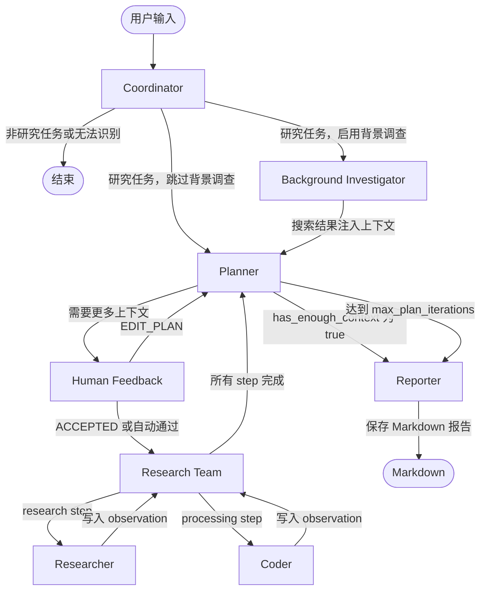

语言环境：[🇺🇸 English](./README.md)

# Deep Research

Deep Research 是一个基于 LangChain + LangGraph 构建的多 Agent 智能研究系统，用于将复杂问题自动拆解、调研、分析并生成结构化 Markdown 研究报告。


## 架构图



## 核心工作流

### Coordinator（协调器）
接收用户输入，判断是否需要进入研究工作流，并提取 `research_topic` 与 `locale`。如果开启 `enable_background_investigation`，任务会先进入 Background Investigator；否则直接进入 Planner。

### Background Investigator（背景调查）
可选节点。在正式规划前对用户问题进行一次网络搜索，将搜索结果作为背景上下文注入 Planner，帮助规划器制定更贴近事实和时效信息的研究计划。

### Planner（规划器）
生成结构化研究计划，包括：
- `title`：研究标题
- `thought`：规划思路
- `steps`：研究步骤列表

每个步骤的 `step_type` 分为：
- `research` → 交给 Researcher 执行网络搜索和资料调研
- `processing` → 交给 Coder 执行代码计算、数据分析或图表生成

如果 Planner 判断已有信息足够（`has_enough_context=true`），会直接进入 Reporter。否则计划会进入 Human Feedback 审核。

### Human Feedback（人工审核）
支持人工确认或修改研究计划：
- `[ACCEPTED]`：接受当前计划并开始执行
- `[EDIT_PLAN]`：要求 Planner 根据反馈重新生成计划

命令行模式下，默认通过 `auto_accepted_plan=true` 自动接受计划。

### Research Team（研究团队编排器）
遍历 `Plan.steps`，找到尚未执行的步骤，根据 `step_type` 路由。所有步骤完成后，流程回到 Planner，由 Planner 判断是否继续迭代或生成最终报告。

### Researcher（研究员）
使用网络搜索工具执行 research 类任务，负责收集事实、资料、链接和引用来源。支持通过 MCP 扩展额外的数据源或搜索工具。

### Coder（编码器）
使用 Python REPL 执行 processing 类任务，适合处理计算、数据清洗、表格分析、图表生成和代码辅助分析等工作。

### Reporter（报告生成器）
汇总所有步骤产生的 `observations`，根据用户 `locale` 使用对应语言生成结构化 Markdown 报告。默认报告结构包括：
- Key Points
- Overview
- Detailed Analysis
- Key Citations

对比信息、统计数据和选项分析优先使用 Markdown 表格呈现。最终报告保存为 `{title}.md`。

## 快速开始

### 1. 克隆项目

```bash
git clone <repository-url>
cd DeepResearch
```

### 2. 安装依赖

推荐使用 `uv`：

```bash
uv sync
```

也可使用 `pip`：

```bash
pip install -e .
```

### 3. 配置环境变量

```bash
cp .env.example .env
```

在 `.env` 中填写必要配置：

```env
LLM_BASE_URL=https://dashscope.aliyuncs.com/compatible-mode/v1
LLM_API_KEY=your_llm_api_key
LLM_MODEL=qwen3-max
LLM_TEMPERATURE=1.2
TAVILY_API_KEY=your_tavily_api_key
SEARCH_API=tavily
AGENT_RECURSION_LIMIT=25
```

### 4. 运行

直接提问：

```bash
python main.py "调研近三年多 Agent 研究系统的发展趋势，并分析 LangGraph 的优势"
```

禁用背景调查：

```bash
python main.py "分析 RAG 与 Agentic RAG 的区别" --no-background-investigation
```

开启调试日志：

```bash
python main.py "调研中国大模型应用生态的最新进展" --debug
```

## 配置详解

### 环境变量

| 变量名 | 默认值 | 说明 |
| --- | --- | --- |
| `LLM_BASE_URL` | 无 | OpenAI 兼容模型服务地址，例如 DashScope 兼容接口 |
| `LLM_API_KEY` | 无 | OpenAI 兼容模型服务 API Key |
| `LLM_MODEL` | 无 | 模型名称，例如 `qwen3-max` |
| `LLM_TEMPERATURE` | 无 | 模型采样温度 |
| `SEARCH_API` | `tavily` | 搜索引擎选择 |
| `TAVILY_API_KEY` | 无 | Tavily 搜索 API Key |
| `AGENT_RECURSION_LIMIT` | `25` | Agent 图执行递归限制 |

### 搜索引擎选项

| 取值 | 说明 |
| --- | --- |
| `tavily` | Tavily Search，需要 API Key |
| `duckduckgo` | DuckDuckGo Search，无需 API Key |
| `brave_search` | Brave Search |
| `arxiv` | ArXiv，论文和学术资料检索 |
| `searx` | SearX / SearXNG，自托管元搜索 |
| `wikipedia` | Wikipedia，百科型背景知识检索 |

### 运行参数

| 参数 | 默认值 | 说明 |
| --- | --- | --- |
| `query` | 无 | 直接传入用户问题 |
| `--interactive` | `false` | 交互式运行 |
| `--debug` | `false` | 输出详细调试日志 |
| `--max_plan_iterations` | `1` | 最大计划迭代次数 |
| `--max_step_num` | `3` | 每个计划最多步骤数 |
| `--no-background-investigation` | `false` | 禁用背景调查 |

## 项目结构

```text
DeepResearch/
├── agents/          # Agent 构建与 LLM 封装
├── config/          # 环境变量、搜索引擎和运行配置
├── graph/           # LangGraph StateGraph 节点、状态和边定义
├── prompts/         # 各 Agent 提示词
├── tools/           # 搜索工具、Python REPL、装饰器和后处理逻辑
├── utils/           # JSON 修复、上下文管理等通用工具
├── main.py          # 命令行入口
├── workflow.py      # 工作流启动、初始状态和 MCP 示例配置
├── graph.py         # 图构建兼容入口
├── pyproject.toml   # 项目依赖与 Python 版本配置
├── .env.example     # 环境变量模板
└── README.md        # 本文件
```

## 扩展指南

### 添加新的搜索工具
1. 在 `tools/` 下实现新的工具函数
2. 在 `config/tools.py` 中添加枚举值
3. 在 `tools/search.py` 的 `get_web_search_tool()` 中接入
4. 在 `.env.example` 中补充所需配置

### 接入新的 MCP 服务
在运行配置中增加服务条目：

```python
"mcp_settings": {
    "servers": {
        "your-mcp-server": {
            "transport": "stdio",
            "command": "uvx",
            "args": ["your-mcp-package"],
            "enabled_tools": ["your_tool_name"],
            "add_to_agents": ["researcher"],
        }
    }
}
```

## License

MIT — 详见 [LICENSE](./LICENSE)。
